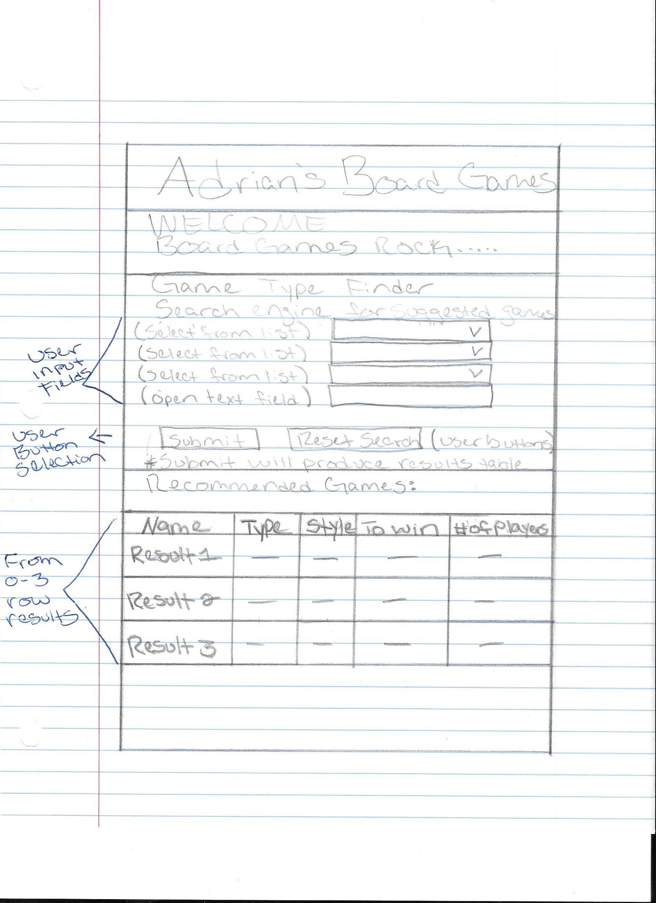
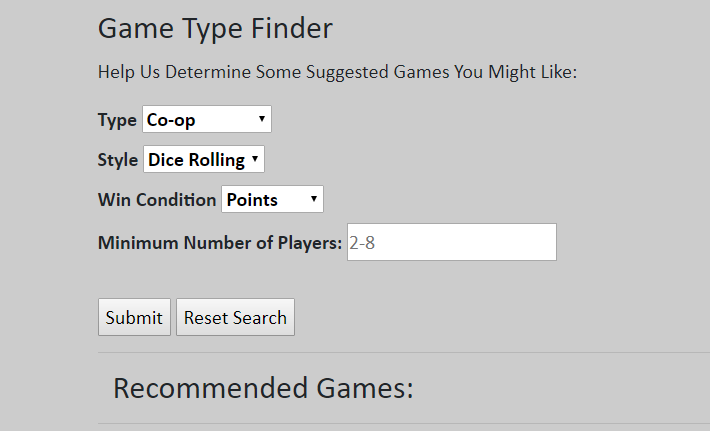

## Homework 2
Our second assignment was to learn Javascript, JQuery, DOM, and Git Branching.  We were to create a new branch within our repository and learn how to update our branch as well as our master link so that we could eventually merge our git branch and master lists back into the same git list. In essence to help us simulate how to work with others or even ourselves from different locations and eventually merging our final product back into one final repository. In addition, I was excited to learn Javascript and JQuery as this is where we could really start manipulating the content on our webpages using code that is similar to c, c++, and java.  Getting used to the new format of this language was a bit challenging at first, but over time I found myself getting the hang of it quickly and with some additional resources such as the "JQuery Cheat Sheet" (see link below) and youtube videos I was able to get a my search result table up and running successfully.

## Links
1. [My Wedbsite - Updated Homepage](https://avickers17.github.io/cs460/HW2/website)
2. [Assignment Page](https://www.wou.edu/~morses/classes/cs46x/assignments/HW2.html)
3. [Code Repository for HW2](https://github.com/avickers17/avickers17.github.io/tree/master/cs460/HW2/website)
4. [JQuery Quick API Reference](https://oscarotero.com/jquery/)

## Want to go back?
* Back to my Homepage: [Homepage](https://avickers17.github.io)
* Back to my Homework Page: [Homework](https://avickers17.github.io/cs460/)

### Javascript and JQuery
Before getting started, we were asked in our assignment to put together a rough sketch of what we were planning on building.  In this way we could plan our design and then design it based on what we had intended to build.  My idea was to take my original website and include a recommended games list based on what the user was looking for.  The search functionality would accept some input from the user via toggle boxes and or typed input and then output a list of recommended games.  I wanted to make sure that my input features were easy to use and clear as to what the search was looking for and how to use it.  I also wanted to make sure that I included error messages in case the user did not find any results or didn't input something correctly.  My initial design sketches were as follows:



### HTML
Most of my HTML and css script was similar as I was using my initial website from HW1, however I added some additional headings, form input classes, and buttons for search:
```html
<!-- Title of user interface used to pull data based on users selections -->
  <div class="container">
  <h2>Game Type Finder</h2>
    <p>Help Us Determine Some Suggested Games You Might Like:</p>
	<!-- labels and drop down slectors -->
	  <label class="labels">Type</label>
		<select class="labels" name="type" id="type">
		  <option value="coop">Co-op</option>
	      <option value="competative">Competative</option>
		</select>
		<br/>
	  <label class="labels">Style</label>
		<select class="labels" name="style" id="style">
		  <option value="dice-rolling">Dice Rolling</option>
		  <option value="puzzle">Puzzle</option>
		</select>
		<br/>
	  <label class="labels">Win Condition</label>
		<select class="labels" name="win" id="win">
		  <option value="points">Points</option>
	      <option value="objective">Objective</option>
		</select>
  <div>
	  <label class="labels">Minimum Number of Players:</label>
	    <input type="text" name="min" id="min" placeholder="2-8"/>
  </div>
  <br/>
  <!-- Submit button that starts jQuery -->
  <input id="submit" type="submit" value="Submit" onclick="clicked()">
  <input id="reset" type="reset" value="Reset Search" onclick="removeNewTable()">
  <hr>
  <div class ="container" id="newList">
  <h2 class="tableBegin">Recommended Games:</h2>
  </div>
  <hr>
  
  </div>
```
### Javascript
Javascript overall reminded me of basic languages such as c and c++.  I found that once I knew where to put in my scripting information on my HTML page, that coding became easier.  You simply had to direct your code and fuctions to specific class objects on the page that would initiate your code.  Examples of this would be button pressing, toggle drop down boxes, or check marks that you could include on your webpage.  Then simply include a section within your HTML script object that would initiate your fuction.  
An Example of Javascript is listed below:

```html
<html>
  <body>
  <!-- Submit button that starts jQuery -->
	<input id="submit" type="submit" value="Submit" 
	onclick="clicked()">
  </body>
</html>
```
```Javascript
<script>
function clicked(){
	if(validateForm() == true){
	  processList();
	  }
</script>
```

### JQuery
JQuery simplified some of this process by allowing you to target specific items in the DOM classes, id's, or elements on your page in which you could then manipulate those objects, add to them, remove them, hide them from view, etc... JQuery had a very different syntax that I was used to however, so I had to utilize many of the tools that were provided to us including the main JQuery API page as listed above.
Once I got the hand of both Javascript and JQuery, I used a combination of both to start putting together my search engine.

The button fuction above was the initializer that made all of my coding work.

#### Input Validation
First the button would check for form validation, in this case to make sure that the user entered in a value that was required and within the limits of the range that I specified, in this case 2-8 was the range that I was looking for.
```Javascript
function validateForm(){
	    var min = document.getElementById('min')
		if(min.value == null || min.value == ""){
		  alert("Number of Players is Required");
		  return false;
	    }
		if(min.value < 2){
		  alert("Min Players must be between 2-8");
		  return false;
	    }
		if(min.value > 8){
		  alert("Min Players must be between 2-8");
		  return false;
	    }
		return true;
	}
```
#### Process List
Once validated, the above function would return true and this would initialize my processList function.  The purpose of this function was to take in all of the users input information, then run a new function that would take my complete list of board games and filter the array based on the search criteria from the users input.  I accomplished this filter by adding a serial code to each board game within my initial array.  The filter would check this code to determine which game matched the selected criteria.  Then the function would return a new list (max size of 3 for the time being) of potential game options for the user to look into.
```Javascript
	function processList(){
	  var type = document.getElementById('type');
	  var sytle = document.getElementById('style');
	  var win = document.getElementById('win');
	  var players = document.getElementById('min');
	  var newList = listFiller(type,style,win,players,fullList);
	  if(newList[0] == null){
	    alert ("Your search did not produce any results");
		return false;
		}
	  else{
	    $("#submit").hide();
	    $(".img-fluid").hide();
	    return listMaker(newList, type, style, win);
	  }
	}
```
#### Add List to the Page
Once the new list was created, I would add this list in the form of a table back to the user with information confirming their selection with the names and maximum number of players that could be supported simply for their reference.  Mostly this was accomplished via JQuery:
```Javascript
//function used to create table based on user parameters
function listMaker(newList, type, style, win){
  $(".tableBegin").append("<table class='table'><thead class='thead'><tr><th scope='col'>Board Game Name</th><th scope='col'>Type</th><th scope='col'>Style</th><th scope='col'>Win Condition</th><th scope='col'>Maximum # of Players</th></tr></thead>").css("font-size","18px");
  $(".table").append("<tbody><tr><th scope='row'>" + newList[0].substr(4) + "</th><td>" + type.value + "</td><td>" + style.value + "</td><td>" + win.value + "</td><td>" + newList[0].substr(3,1) + "</td>");
  $(".table").append("<tbody><tr><th scope='row'>" + newList[1].substr(4) + "</th><td>" + type.value + "</td><td>" + style.value + "</td><td>" + win.value + "</td><td>" + newList[1].substr(3,1) + "</td>");
  $(".table").append("<tbody><tr><th scope='row'>" + newList[2].substr(4) + "</th><td>" + type.value + "</td><td>" + style.value + "</td><td>" + win.value + "</td><td>" + newList[2].substr(3,1) + "</td>");
}
```
#### Reset Search Option
To wrap up the search, I included a reset button.  This was made for two reasons, first to allow the user to search again, and secondly it would prevent the above code from continue to append to the table.  I hid the search button and repaced the button with the reset button to avoid this scenario.
```Javascript
	//function used to reset the search
	function removeNewTable(){
	$(".table").remove();
	$(".img-fluid").show();
	$("#submit").show();
	
	  }
```
#### Search Engine Complete
With my search engine complete, adding additional games to my list or increasing the output of the search criteria would be easy edits as I had created a serial code that could be used for any addition that I wanted to add.  To save room on the page, I could also include a seperate file that housed this information, however I chose not to for the time being to keep things simple.  These are edits I will consider as my website continues to evolve.



### Git Branching
Finally to complete this process, I had to merge my branch back into the master for my repository.  This was completed by a simple git merge function that was done after i made changes to my master, and completed my work on the side branch that I had created to complete HW2 on.

```
git branch HW2-Feature
git checkout master
git merge HW2-Feature
git push origin master
```
