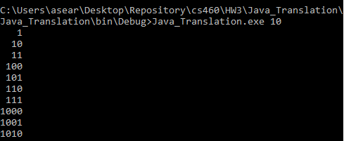

## Homework 3
For this assignment we were tasked with translating one language to another.  Specifically translating javacode to C#.  Having a C++ background made this assignment a bit more challenging for me, but knowing that the challenge would only continue to evolve my skills as a coder, I dove right in. 

## Links
1. [Assignment Page](https://www.wou.edu/~morses/classes/cs46x/assignments/HW3_1819.html)
2. [Code Repository for HW3](https://github.com/avickers17/avickers17.github.io/tree/master/cs460/HW3)

## Want to go back?
* Back to my Homepage: [Homepage](https://avickers17.github.io)
* Back to my Homework Page: [Homework](https://avickers17.github.io/cs460/)

### Classes in C# (NODE)
To start of, we were given a list of of potential files that we should build in a specific order, this way our project would come together more effeciently. We were advised to build the node class.  Classes in Java are very similar to C++ with the exception that most classes in Java are delared as a reference using the "new" command.  This takes some getting used to as you don't always have to declare classes this way in c++.  The good news was however that C# seemed to follow this same concept.  So after getting used to the way that classes were declared and used in Java, I was more prepared to use them in C#.  One of the new features in C# however was using the "get" "set" commands.  These commands allow you to easily set up functionality to set up private variables of the class object.  You can make your variables private within the object and use the set and get functions to set the objects value and get the objects value when called using the class.set or class.get functions.  This allows you to put restrictions easily to stop objects from being created with values that are incorrect or not allowed.  For example, if you didn't want a person object to have a negative again, you could put a if statement on the age value making sure that the number is within the parameters that you specified.  I didn't use restrictions in the following code transation as these restrictions were not in the original file, but I set up the class in a way that left this open and followed the conventions of the c# language.
```cs
public class Node<T>
{
    private T data;
    public T Data
    {
        get { return data; }
        set { data = value; }
    }
    private Node<T> next;
    public Node<T> Next
    {
        get { return next; }
        set { next = value; }
    }

    public Node(T Data, Node<T> Next)
    {
        this.data = Data;
        this.next = Next;
    }
}
```

### Interface Files (IQueueInterface)
What seemed to be similar to .header files in c++ were files called interfaces.  Conventionally, however you need to start the title of your interface with a captial I such as "IQueueInterface."  In C#, this was a location that you declare methods/functions, but only delcare them, and then any class that uses this interface would have to use and define the fuctions that were declared in that interface.  This makes sure that any class that followed the functionality needed in your program and inherited an interface would be gauranteed to have the necessary functions required. Once I understood what an interface was, this was a simple transition/implementation:
```cs
interface IQueueInterface<T>
    {
        T Push(T element);
        T Pop();
        Boolean IsEmpty();
    }
```

### Exceptions (QueueUnderflowException)
Exceptions are definitely implemented similarly to c++ and Java in C#.  Specifically with "try", "catch", and "throw" key words. However the syntax for inheritence was much more like c++ and less like Java.  Once I understood the different names and keywords to use in order to get the correct librarys in for exceptions, this page was overall easy to implement and understand.  Basically, I would inherit system exceptions from the SystemException library, use this for my default QueueUnderflowException via constructor.  I could also use another QueueUnderflowException and include a message as demonstrated on the Linklist page that followed.  This class page simply defined the exceptions used whenever the queue was empty for my LinkedQueue class.  

```cs
public class QueueUnderflowException : SystemException
    {
        public QueueUnderflowException() : base() { }
        public QueueUnderflowException(string message) : base(message) { }
    }
```

### Building and Using the Queue(LinkedQueue)
Building and using the LinkedQueue class wasn't to difficult.  The class would inherit from IQueueInterface making sure that it had the necessary defined methods.  Then it would include 2 private nodes.  These would act as references that would maintain order to provide a first in first out rotation of node information.  The push function would first check if the data that was being pushed into the queue was null, if so throw an exception.  If the queue was empty, it would set itself as the first and rear, therefore only node.  Otherwise it would put itself at the end of the queue.  The pop function would throw the QueueUnderflowException if it was empty as you can't pop from an empty queue.  If not empty, it would remove it from the queue.  If it was the only object, it would reset the references to null, otherwise update to the next node in the queue as necessary.  The isEmpty function would simply return true or false if the queue was empty for the previous two functions.  Following conventions for C#, I made sure to captialize any and all functions.

Exaple C# Code below:

```cs
 class LinkedQueue<T> : IQueueInterface<T>
    {
        private Node<T> front;
        private Node<T> rear;

        public LinkedQueue()
        {
            front = null;
            rear = null;
        }
        public T Push(T element)
        {
            if (element == null)
            {
                throw new NullReferenceException();
            }
            if (IsEmpty())
            {
                Node<T> tmp = new Node<T>(element, null);
                rear = front = tmp;
            }
            else
            {
                Node<T> tmp = new Node<T>(element, null);
                rear.Next = tmp;
                rear = tmp;
            }
            return element;
        }
```

#### Pulling it All Together (Program.cs)
Now that I had all of my classes and my interface, I was ready to move to the main function and final method that would pull it all together.  The program page started with a function GenerateBinaryList that would return a LinkedList of Strings.  This functions main job was to take in the int(cast as needed) argument from the user as the program was ran.  Then build a list of binary numbers up to the maximum number as declared by the argument.  The list would start with 1, then use the queue to push the subsquent numbers 2, 3, 4, etc...in binary onto the list, using the queue push function to maintain the order.  Once the max value argument n was brought to zero, the list would be complete and then be returned to the main function.  Main would first check to make sure that a positive number was provided (if not output would be given to the user to retry the program with a valid argument), then it would run the GenerateBinaryList function to build the linked list of numbers.  Then output the numbers in a way that maintained a right indent keeping the output clean and aligned.  Once again mainy of the functionality and class functions were different in c# and I adjusted as necessary to make sure that conventions were followed and that the program would product the same output, in the same way as the Java code did.


```cs
//Main program that runs function and checks for input error from user
static void Main(string[] args)
{
    //Initialize int n
    int n = 10;
    //Check to make sure user provided argument
    if (args.Length < 1)
    {
        //If user did not provide argument, return error message
        Console.WriteLine("Please invoke with the max value to print binary up to, like this:");
         Console.WriteLine("Main.exe 12");
    }
    try
    {
        //Attempt to cast received argument into an int and set to "int n"
        n = int.Parse(args[0]);
    }
    catch (FormatException e)
    {
        //If excetpion is caugt, return console information to the user and end program
        Console.WriteLine("Sorry, I can't understand the number: " + args[0]);
        return;
    }
    //If n is parsed correctly, run function to generate Binary list and return list
    LinkedList<string> output = Program.GenerateBinaryList(n);

    //Int used for spacing when writting out list, set to the maximum length of the longest string within the list 
    int maxLength = output.Last.Value.Length;

    //Loop that cycles through output list and ends when reaches the last string in the list
    foreach (string s in output)
    {
        //Inside Loop for adding space before the shorter strings in output to add a clean output look to the user  
        for (int i = 0; i < maxLength - s.Length; ++i)
        {
            Console.Write(" ");
        }
    Console.WriteLine(s);
    }
    //Keeps console open for user to view until enter is pressed.
    Console.Read();
}
```

### Final Thoughts and Output
Learning to translate one language that I was unfamiliar with to a language that I was learning was no easy task.  But I did my research, watched some educational videos, and pushed through.  I feel like I actually have a better understanding of both languages at this point and hopefully followed all of the necessary conventions.  At this point, I know how to generally code in c#, so my plan is to continue on learning new functionality and conventions as needed so that my coding skills will not only improve in this language, but any language that I attempt to learn as a programmer.

When all was said and done with this program, my output worked as designed.  An example of this is shown below:


