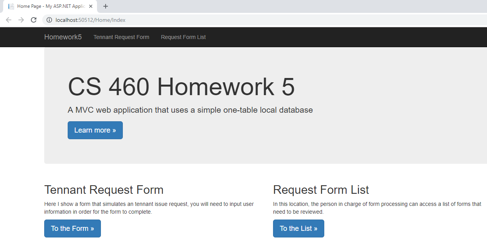
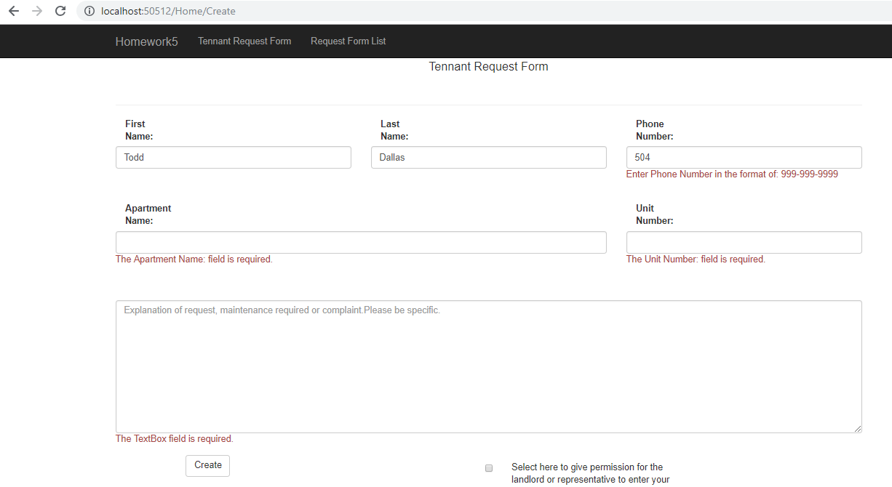
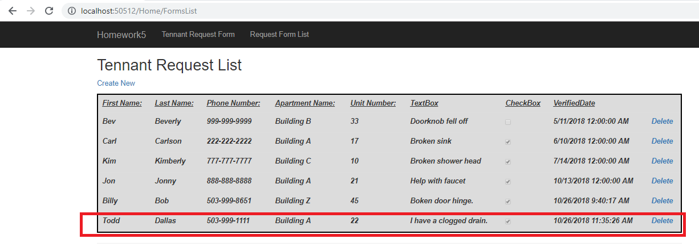
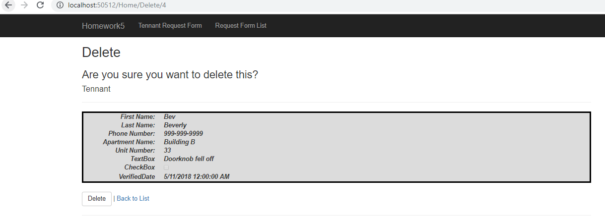
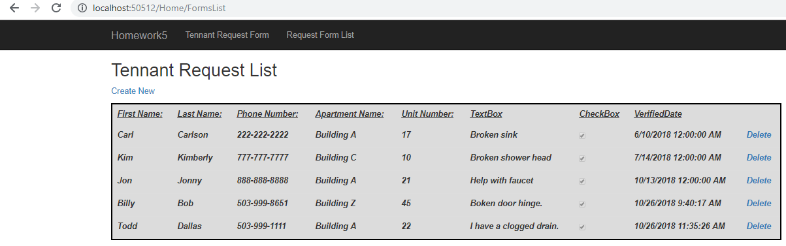

## Homework 5
For our next assignement, we dove further into using ASP.NET MVC 5 setting up and accessing a 1 table database.  Our goal was to create a form that could be viewed, submited, and then updated within our database.  In addition, we would have functionality that would list out all of our entries on another page in a list type of format.  Setting up a database was exciting as it allowed for us to modify specific pages once our resources were called via get requests and display new information based on the actions taken by our users.
  
## Links
1. [Assignment Page](https://www.wou.edu/~morses/classes/cs46x/assignments/HW5_1819.html)
2. [Code Repository for HW5](https://github.com/avickers17/avickers17.github.io/tree/master/cs460/HW5)

## Want to go back?
* Back to my Homepage: [Homepage](https://avickers17.github.io)
* Back to my Homework Page: [Homework](https://avickers17.github.io/cs460/)

### Database Construction (Creation and Connection)
The first task we had to accomplish was to set up the database.  We start by creating one which can be linked to a different system or you can use a database feature called LocalDB.  This is a seperate downloadable package provided by ASP.NET.  I used this one as it made it convient for learning the basics.  We had to access and add a database item within the app_data folder.  Once added, we have to walk through a series of steps to connect the information and add a specific path into our web.config file.  Once set up, we can begin the process of creating SQL commands and link the commands to our database to begin setting up our tables and/or first entries as needed, then simply hit the execute button.

Example below:
```sql
--Forms Table
CREATE TABLE [dbo].[Tennants]
(
	[ID] INT IDENTITY (1,1) NOT NULL,
	[FirstName] NVARCHAR(64) NOT NULL,
	[LastName] NVARCHAR(64) NOT NULL,
	[PhoneNumber] NVARCHAR(12) NOT NULL,
	[ApartmentName] NVARCHAR(64) NOT NULL,
	[UnitNumber] INT NOT NUll,
	[TextBox] NVARCHAR(500) NOT NULL,
	[CheckBox] BIT NOT NULL,
	[VerifiedDate] DATETIME NULL,

	CONSTRAINT [PK_dbo.Tennants] PRIMARY KEY CLUSTERED ([ID] ASC)
	);

	INSERT INTO [dbo].[Tennants] (FirstName, LastName, PhoneNumber, ApartmentName, UnitNumber, TextBox, CheckBox, VerifiedDate) VALUES
		('Jon','Jonny','888-888-8888', 'Building A', 21, 'Help with faucet', 1, '2018-10-13'),
		('Kim','Kimberly','777-777-7777', 'Building C', 10, 'Broken shower head', 1, '2018-7-14')
		GO
```


### Model Class and Database Context Class
Next we had to create classes that would be the foundation for accessing our database.  Specifically I create a Tennant class that included all of the information needed for a tennent to fill out necessary information needed for the form.  Within the class, we were shown how to set required fields that would be enforced here vs. within our HTML text which seemed more efficient.  Rules could be set and efforced as we were building the class so that these rules were easier to access and see all in one place.

Example fields of the Tennant Class:
```cs
public class Tennant
    {
        //tennant class to be used within the db and for get/post requests
        [Key]
        public int ID { get; set; }

        [Display(Name= "First Name:"), Required(ErrorMessage = "Name must be at least 3 characters long")]
        [StringLength(30, MinimumLength = 3)]
        public string FirstName { get; set; }

        [Display(Name = "Last Name:"), Required]
        [StringLength(30, MinimumLength = 3, ErrorMessage = "Name must be at least 3 characters long")]
        public string LastName { get; set; }

        [Display(Name = "Phone Number:"), Required]
        [RegularExpression("^[0-9]{3}-[0-9]{3}-[0-9]{4}$", ErrorMessage = "Enter Phone Number in the format of: 999-999-9999")]
        public string PhoneNumber { get; set; }
```
As you can see above, I was able to set restrictions on class items such as phone number using regular expressions.  And I could set error messages in the case the the user was not entering the information in correctly.  I was also able to set minimum and maximum length for the fields while making them required as to avoid leaving out critical information.

In addition, we had to create the Database Context Class that would work to provide a list of Tennents or Tennant objects to be seen in a view for a FormList page.  This class was necessary so that when we returned a view back using a get request, we could return a list object that would query the database providing and updated list based on whether we added or deleted an entry from the database.
 
Example of Database Context Class:
```cs
{   //class for creating a list of tennants using the db
    public class FormsContext : DbContext
    {
        public FormsContext() : base("name=FormData") { }

        public virtual DbSet<Tennant> Tennants  { get; set; }
    }

}
```

### GET-POST-Redirect Pattern
To improve our ASP.NET skills we needed to learn how to redirect  when specific actions were taken by the user.  Such as when a form has been submitted, where does the user go from here?  Or if the user doesn't complete the form, how do we redirect them to make sure that data isn't lost.  The answer is called GET-POST-Redirect Pattern that basically fucntions just as described above.  As users do specific actions, we direct the user accordingly based on the functionality that we have set up within our controller.  An example of this is listed below: 

Example of GET-POST-Redirect:
```cs
        [HttpPost]
        [ValidateAntiForgeryToken]
        public ActionResult Create([Bind(Include = "ID,FirstName,LastName,PhoneNumber,ApartmentName,UnitNumber,TextBox,CheckBox,VerifiedDate")] Tennant tennant)
        {
            //if form has been completed correctly and submitted
            if (ModelState.IsValid)
            {
                //access db and insert/stage new tennant data
                db.Tennants.Add(tennant);
                //save the db
                db.SaveChanges();
                //get request to take the user to the formlist view
                return RedirectToAction("FormsList");
            }
            //if form was not filled out correctly, return to the create page keeping current data
            return View(tennant);
```

In this example, if the ModelState is valid or basically if the class information has been completed as required by the class, then we access the database, stage the new entry for saving, then save the entry to the database.  From there we can return the user to a new view, or any view of our chosing.  In my case, I simply take the user to the list of forms in the "return RedirectToAction("FormsList")" action.  If the user has not completed the required fields, instead I return them back to a bound view that simply keeps them on the create page and retains the data already entered by the user thus far.  This was the user is not forced to start over if they didn't complete the form in it's entirety. 

### Strongly Typed Views
This is where the magic of the above happens where we maintain the data that the user has provided and return this view back to the user without losing their entry information.  We use Strongly Typed views that work to provide this information back to the user as it is being entered.  Using Razor code, I created the UI in HTML format that would show be provided by the view and update as the user entered in information returning the view back to the user as they progressed throught the form. 

Example of Strongly Typed Views:
```cs
@model Homework5.Models.Tennant

@{
    ViewBag.Title = "Create";
}

<h2 class="form_title">Campus Apartments</h2>
<br />
<h4 class="form_title">Tennant Request Form</h4>
<br />
@*Form information used for the create get/post requests*@
@using (Html.BeginForm())
{
    @Html.AntiForgeryToken()
    <hr />
    @Html.ValidationSummary(true, "", new { @class = "text-danger" })
    <div class="form-group">
        <div class="row">
            <div class="col-sm-4">
                @Html.LabelFor(model => model.FirstName, htmlAttributes: new { @class = "control-label col-md-2" })
                @Html.EditorFor(model => model.FirstName, new { htmlAttributes = new { @class = "form-control" } })
                @Html.ValidationMessageFor(model => model.FirstName, "", new { @class = "text-danger" })
            </div>
```
Labda functions are used to return information that is being provided back to the user through a get request in the event that they do not input all of the information as required.

### Demo of Working Site
All that was left was to confirm that the site was working as expected.  See below for steps on how my form and formlist work in a series of pictures below:

Example Homepage (I click on the "To the Form" button):


Example Incomplete Form-User is provided a new get request view with partial information completed (I click on the "Create" button):


Example Completed Form-User fills in all info (I click on "Create", the Post request redirects me to a GET request for Formslist):


Example Delete Page Form-User Clicks on Delete a next to a form (I click delete the top Entry for Bev Beverly and am sent to a delete confirmation view):


Example Confirmed Deleted-User Clicks on Delete (I click delete at the bottom, I am redirected to a GET view with an updated FormsList-Bev Beverly has been removed):


