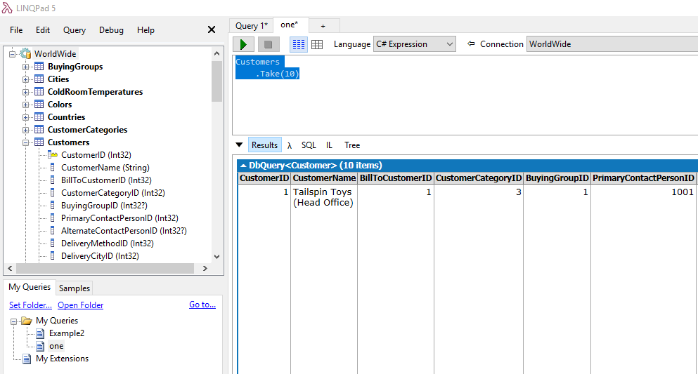
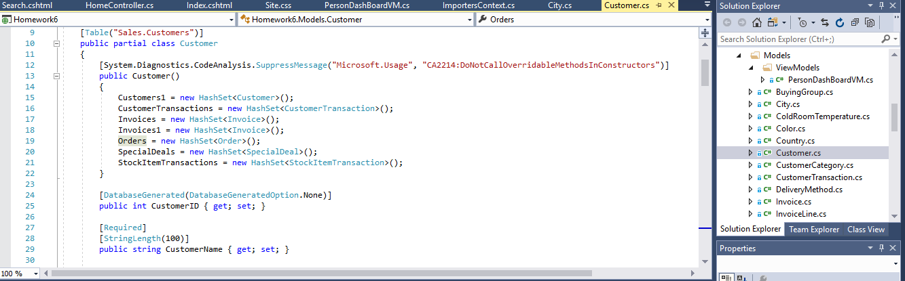
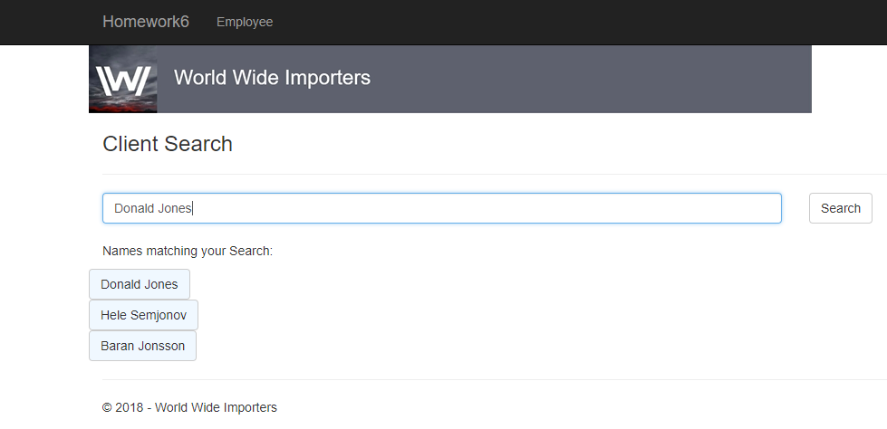
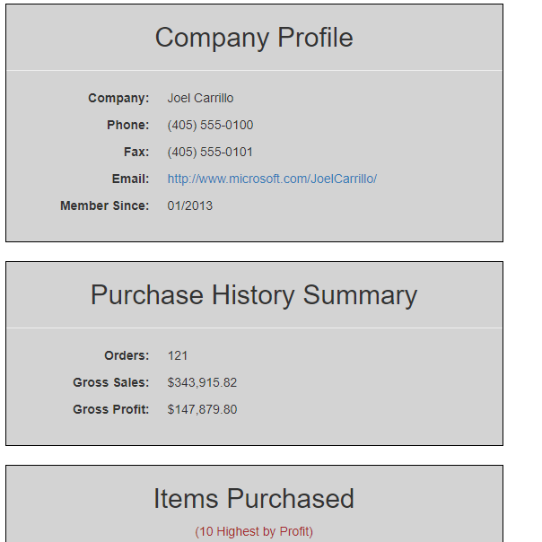

## Homework 6
For assignement 6 we were tasked with using ASP.NET MVC 5 to access and use a pre-existing complex database.  Our goal was to not only traverse this large database, but to assign query information to MVC objects that could be accessed and displayed for the user.  Specific tasks included: connecting to the database, traversing the data, creating a class of classes and objects that could be returned in a view, creating a search bar that would use the database to present a user with list of options, and provide additional information based on the specific results of the search.
  
## Links
1. [Assignment Page](https://www.wou.edu/~morses/classes/cs46x/assignments/HW6_1819.html)
2. [Code Repository for HW6](https://github.com/avickers17/avickers17.github.io/tree/master/cs460/HW6)
3. [Working Demo](https://www.youtube.com/watch?v=rs-3XO3AHuk&feature=youtu.be)

## Want to go back?
* Back to my Homepage: [Homepage](https://avickers17.github.io)
* Back to my Homework Page: [Homework](https://avickers17.github.io/cs460/)

### Database Setup (Downloads and Connection)
The first task we had to accomplish was to restore a large pre-existing database.  We had to first install additional tools that allowed us to access and utilize this information including SQL Server Management Studio and SQL Server Express.  These tools allowed for us to connect ASP.NET to this information and load it into our application.  In addition we had to add some additional pieces of code to our Global.asax.cs file.  Once everything was set up, we were able to access the database within our application and begin running database queries directly in C# code.  We were also encourged to use a tool called LINQPad 5 which allowed us to access the same database information and test queries prior to using them in C#, an example of the database as shown in LINQPad 5 and query code is listed below:

Example LINQPad 5 Query:


### MVC 5 Setup (Class Designs)
Now with the database connected, we were able to have MVC 5 put together Classes/Models from each of the tables within the database allowing us to use these classes within our controllers and views. Then we had to move the DBContext class to its correct location within the DAL folder.   

Example Model/Class Autocreated by MVC 5:


### Content/Coding (People Search)
With the setup complete, it was time to start putting together the search page.  I started with the view page for searching, putting together the text field, button and returned results formating.  Then I had to contruct the controller that returned my view.  This view would changed based on the search results, either returning no results, 1 result, or many results listing customers/employees who's names included the search criteria.  Some examples of this code is show below:

Example of View for Search:
```cs
@model IEnumerable<Homework6.Models.Person>
@{

   ViewBag.Title = "Search";
}
<div class="row">
    
</div>
<h3 class="form-title" id="searchEngine">Client Search</h3>
<hr />
<form action="search" method="get">
    <div class="row">
        <div class="col-sm-8">
            @*Input area for search*@
            @Html.EditorFor(model => model.FirstOrDefault().FullName, 
           new { htmlAttributes = new { @class = "form-control", placeholder = "Search by Client Name" }})
        </div>
        <div class="col-sm-4">
            <input type="submit" value="Search" class="btn btn-default" />
        </div>
    </div>
</form>
```

Example of Contoller for Search:
```cs
//Get Request for Search View Page
        [HttpGet]
        public ActionResult Search()
        {
            //start with message not showing
            ViewBag.show = false;
            //get the name from the query string
            string name = Request.QueryString["FullName"];
            string heading = "Names matching your Search:";
            string headingTwo = "I'm sorry, your search returned no results";
            ViewBag.message = "";
            //search the db for a list of people whos name contain the user's search entry
            var list = db.People.Where(n => n.FullName.Contains(name)).ToList();
            //if the query is not empty and the list is not empty
            if (name != null && !list.Any())
            {
                //Message shows, return the list to the search view
                ViewBag.message = headingTwo;
                ViewBag.show = true;
                return View(list);
            }
            //if the query name was not empty but the list didnt return any results
            else if(name != null && list.Any())
            {
                //show a no results message, return the basic view and empty list
                ViewBag.message = heading;
                ViewBag.show = true;
                return View(list);
            }
            //else simply show the viewpage for search
            else
            {
                return View(list);
            }
        }
```

In the basic search case, we focused on returning specific information about the customer/employee including:
1. Full Name
2. Their preferred name
3. Phone Number
4. Fax Number
5. Email address (as a mailto link)
6. The date they became a customer, member or employee
7. A photo placeholder until they start putting photos in the database

Search Results Example:


View Landing Page Example People Search:


### Content/Coding Feature #2 (Customer Sales Dashboard)
Next we were to upgrade our search engine to return additional information in the event that the person selected was actually a customer instead of an employee.  This task required much more traversal of the database due to the amount of information that we needed to obtain and display. In addition, we are only able to return one object back to our view, so we had to create an object housing other objects.  We did this in the form of a Model called a ViewModel. I created a new class that would collect all of the information necessary based on if they were a customer or an employee.  

Example of my ViewModel Class:
```cs
   public class PersonDashBoardVM
    {
        public Person Person { get; set; }

        public Customer Customer { get; set; }

        public IEnumerable<InvoiceLine> InvoiceLines { get; set; }

        public IEnumerable<Order> Orders { get; set; }

        public int OrderTotal { get; set; }

        [DisplayFormat(DataFormatString = "{0:C}")]
        public decimal GrossSales { get; set; }

        [DisplayFormat(DataFormatString = "{0:C}")]
        public decimal GrossProfit { get; set; }

    }
```

With this in place, I could initialize this class when first directed the my Action in my controller.  If the person was an employee, I would gather the required information for an employee only and do a database search for the Person object within this class, then return my full PersonDashBoard object to the view.  If they were a customer, additional data would be collected and then returned further updating the PersonDashBoard Class.

Example of Controller Code for a Customer:
```cs

//If the person has customer data, they are a customer
    if (vm.Person.Customers2.Count() > 0 )
    {
        //View information will display in view
        ViewBag.Check = true;
                
        //Set an int linking the person id and the customer information id
        int custId = db.People.Find(id).Customers2.FirstOrDefault().CustomerID;

        //Set vm.Customer information to the first customer object in person's customer database info
        vm.Customer = vm.Person.Customers2.FirstOrDefault();

        //Set vm.Orders to that customers list of orders placed 
        vm.Orders = vm.Customer.Orders.ToList();
                
        //Set vm.OrderTotal to the total amount of orders placed by customer
        vm.OrderTotal = vm.Customer.Orders.Count;
                
        //Get a list of orders to sum the total amount spent in orders
        var total = vm.Orders.SelectMany(i => i.Invoices)
		.SelectMany(inv => inv.InvoiceLines).Select(price => new { price.ExtendedPrice }).ToList();

        //Set vm.GrossSales to the total of that list based on ExtendedPrice column
        vm.GrossSales = total.Select(i => i.ExtendedPrice).Sum();

        //Get a second list of order information for LineProfit data
        var secondTotal = vm.Orders.SelectMany(i => i.Invoices)
		.SelectMany(inv => inv.InvoiceLines).Select(price => new { price.LineProfit
        }).ToList();

        //Set vm.GrossProfit to the sum of second list
        vm.GrossProfit = secondTotal.Select(i => i.LineProfit).Sum();

        //Set vm.InvoiceLines list to the list of the top ten most expensive items purchased by customer
        vm.InvoiceLines = vm.Orders.SelectMany(i => i.Invoices).SelectMany(inv => inv.InvoiceLines)
            .OrderByDescending(i => i.LineProfit).Take(10);
    }
    //Return vm object for viewing
    return View(vm);
```

With this new view, we were tasked with returning additional customer information including:

For the company: 
1. Company name
2. Phone number
3. Fax number
4. Website (as a link)
5. What year they started as our customer

Purchases: 
1. How many orders this company has made
2. The total gross sales to this company
3. The profit total have we made from this customer
4. The 10 most profitable items this customer has purchased 

Results View for Customer:


### Video Demo
To Wrap it all up, we were asked to create a demo video showing our work.  Above you can find a link to that demo.

### Conclusion
Working with a large scale database and Linq queries was challenging, but really exciting once I started understanding how to utilize them more effectively.  Going forward I am excited at the idea of being able to traverse a real live database, utilizing actual data to complete coding tasks, and presenting this data in a clean and concise fashion. 
