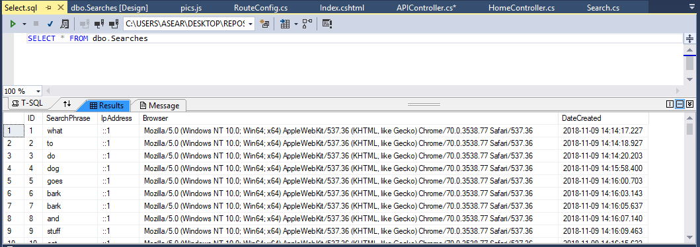

## Homework 7
Homework 7 was one of the most challenging homeworks to date, but what I did like about this particular assignment was that we got to mix many of the components that we had learned this term together. We were tasked writing Javascript which would have functionality to make a GET Request sent to one of our controllers, the controller would then make another GET request to an outside source, and then our controller would return that response in the form of JSON data back to our Javascript code.  With this information, we would parse through and find components we needed or wanted to use.  Our task specifically was to find url information embeded within the returned JSON data and present it to the user as they typed in a text field creating a dynamic page that updated as it was being used vs. having to load a new page each time the user entered in new information.
  
## Links
1. [Assignment Page](https://www.wou.edu/~morses/classes/cs46x/assignments/HW7_1819.html)
2. [Code Repository for HW7](https://github.com/avickers17/avickers17.github.io/tree/master/cs460/HW7)
3. [Working Demo](https://www.youtube.com/watch?v=xfldBzaJML0&feature=youtu.be)

## Want to go back?
* Back to my Homepage: [Homepage](https://avickers17.github.io)
* Back to my Homework Page: [Homework](https://avickers17.github.io/cs460/)

### Setup (View and Controller)
Starting out, we were to create an empty MVC Web Application that would only include one view for the user.  This is the page that would dynamically function and load information as the user interacted with it.  The page would simply include a title and text bar that the user would enter information into.  I decided to use a form-control text bar because I liked the look and layout of this item.  However this also meant that I would have to disable the functionality of pressing the "enter" key.  This is standard for this type of form entry that when a user presses enter, information would be sent to another controller requesting a new or updated view.  I did not want this functionality, so I added some Javascript to diable this.

Example of HTML Code for View:
```html
<h2 style="text-align:center">Internet Language Translator</h2>
<form method="get">
    <div class="row">
        <div class="col-sm-2">
        </div>
        <div class="col-sm-8">
            <input class="form-control" type="text" id="translator" 
			placeholder="Start typing your message here..." onkeypress="return noenter()">

        </div>
        <div class="col-sm-2">
            <input class="btn btn-default" onclick="return clear()" value="Clear" type="submit">
        </div>
    </div>
</form>
```

You can see the form-control uses the "return noenter" function again disabling that functionality, an I added a clear button to allow the user to reset the text bar. I added the following Javascript for those two components:

```js
function clear() {
    $('#translator').empty();
}

//function that prevents the user from using the form field for a new GET request
function noenter() {
    return !(window.event && window.event.keyCode == 13);
}
```

### Giphy Setup (Account and Key Creation)
Next we had to create an account with Giphy and register as a developer.  With this registration, we were provided an authentication key that would allow our program to make the get requests to Giphy and receive JSON data back from their servers.  Hiding this key was also crucial as we didnt want to make the call simply in our Javascript.  Doing so could expose our key to our users if they looked into our GET request.  Instead we make the call to Giphy inside of the controller and we have our controller pull the key from an outside file.  An example of how I used this in my controller is shown below: 

```cs
[HttpGet]
        public JsonResult Picture(string id)
        {
            //get my apiKey for giphy
            string apiKey = System.Web.Configuration.WebConfigurationManager.AppSettings["CS460ConfirmationKey"];
```

### Making the View Page Dynamic (Javascript Coding)
Now that we had a Giphy Account setup, it was time to start making Javascript do the work of making this process happen.  I began by putting together a function that would wait for the user to press the spacebar key.  Once pressed, Javascript would start the process.  It first would grab the input the user pressed before the "spacebar" button.

Example Javascript Spacebar Function:
```javascript
//Initial Function that starts Java once spacebar is pressed
$('#translator').bind('keypress', function (e) {
    if (e.which === 32) {
        var input = document.getElementById('translator');
        //call api function and submit the text field value
        apiRequest(input);
        }
    }
);
```

This function would then call a new function passing in the text information.  This new function would be responsible for making a GET request to my controller.

Example of apiRequest Function:
```javascript
function apiRequest(results) {
    //Get the Text Field and grab the last word
    var a = results.value;
    var b = a.split(" ");
    var c = b[b.length - 1];

    //create a source API path to my controller and include last word as url parameter
    var source = "/Search/Picture/" + c;

    //This makes the get request to my controller
    $.ajax({
        type: "GET",
        dataType: "json",
        url: source,
        success: displayData,
        error: errorOnAjax
    });
}
```

The apiRequest function first breaks up the input, this way each time the call was made, we are only using the last word the user entered.  Then an ajax call is made to my controller.  My controller is called APIController, however the path for this is not shown here, this is because we also needed to create a custom routing path.  I'll show more of that below.  The ajax function makes a GET request to my controller using JSON information, passing in my custom url defined as "source." Then checking to see if the request was successful or fails.  If successful, a new function called "displayData" is called, otherwise the function errorOnAjax is invoked.  ErrorOnAjax simply returns an error message to the console, but the display data is where the next steps take place.
 
Example of displayData function:
```javascript
//If Get Request is successful, get the json data and get the url out of it
function displayData(data) {
    //list of words not to be turned into pics
    var boringWords = ["and", "if", "or", "to", "I'm", "not", "for", "not", "do", "my", "going"];
    var input = document.getElementById('translator');

    //Again get the last value of what the user typed
    var a = input.value;
    var b = a.split(" ");
    var c = b[b.length - 2];

    //From the returned json data, get the url of the picture we wanted
    var image = data.data.images.original.url;
    var bool = true;

    //Compare the last word entry to the list of boring words
    for (var i = 0; i < boringWords.length; i++) {
        if (boringWords[i].toUpperCase() === c.toUpperCase()) {
            bool = false;
        }
    }

    //If word was in list append word, if not append picture to the page
    if (bool == false) {
        $('#results').append("<label>" + c + "&nbsp;</label></div>");
    }
    else {
        $('#results').append("</div>");
    }
}
```

This function accesses the data returned from the controller (which I will demonstrate below) and do some work to compare the word put in by the user and cross reference this word against a list of "boring" words, basically words that I didn't want returning a picture.  Also from the data returned, I grab the url information returned from the GET request embeded in the JSON text here called "data." If the users word is not classified as boring, my function would appended an img html element with the embeded url initialize and then display that picture back to the user.  Otherwise, I would simply append the word to the screen for the user to see.
 
### APIController (C# JSON Reslt)
To further create this functionality, we needed our controller to make a GET Request to Giphy and we needed our controller to only return JSON data instead of a new view again making our main page dynamic instead of loading an entirely new view. We did this by making a JsonResult method.  This method would take our Giphy key, create a url using the user input, make the request, process the received information and put in back into json readable format, return it to the javascript ajax call, and lastly log the request inside a local database.  Example of the controller code is shown below:

Example of GET Request to Giphy:
```cs
//get my apiKey for giphy
            string apiKey = System.Web.Configuration.WebConfigurationManager.AppSettings["CS460ConfirmationKey"];
            
            //build URL for GET request to giphy, including my key and url parameter
            string urlInfo = "https://api.giphy.com/v1/stickers/translate?api_key=" + apiKey + "&s=" + id;
            
            //Make a request using my urlInfo, then grab response information
            WebRequest request = WebRequest.Create(urlInfo);
            WebResponse response = request.GetResponse();
            Stream information = response.GetResponseStream();
            StreamReader reader = new StreamReader(information);

            //Grab full response information, read to the end of the data and put it into a string
            string responseString = reader.ReadToEnd();

            //Parse through the JSON object 
            var jsonSerialize = new System.Web.Script.Serialization.JavaScriptSerializer();
            var data = jsonSerialize.DeserializeObject(responseString);
			
			//Close the streams
            reader.Close();
            information.Close();
            response.Close();

            //Return JSON obj back to javascript for display purposes
            return Json(data, JsonRequestBehavior.AllowGet);
        }
    }
```

Example of storing the ajax request in my local database:
```cs
 //create a database search object based on the GET request user information
            Search logItem = new Search();
            logItem.SearchPhrase = id;
            logItem.IpAddress = Request.UserHostAddress;
            logItem.Browser = Request.UserAgent;

            //Log and Save the request to the DB
            db.Searches.Add(logItem);
            db.SaveChanges();
``` 

Example of Model for the log/Search Class:
```cs
public class Search
    {

        public int ID { get; set; }

        public string SearchPhrase { get; set; }

        public string IpAddress { get; set; }

        public string Browser { get; set; }

        private DateTime Date = DateTime.Now;

        //VerifiedDate set by date class to set when the request was created
        public DateTime DateCreated
        {
            get { return Date; }
            set { Date = value; }
        }
    }
```

### Custom Routing (App_start RouteConfig)
One additional component we were tasked to make this work was to make our own custom routing path that our ajax function would use to call our APIController.  I created my own as shown below, this allowed AJAX to call my controller even though the route name did not match my controller name.

Example of Custom Route:
```cs
 routes.MapRoute(
                name: "Search",
                url: "Search/Picture/{id}",
                defaults: new { controller = "API", action = "Picture", id = UrlParameter.Optional }
            );
```

### Log the Requests(Database Storage)
And as a last component to making this all work, we were we tasked with storing these requests into a local database.  As like previous homeworks, I created my own local DB that was based around my Search Model Class.  I created a DAL folder and SearchContext Class. Using these components, I created a database and table, then as per my c# code above, saved each ajax get request to my local database storing:
1. Date/time of the request
2. The Request itself (the user word text)
3. The IP address of the Requestor
4. The Clients Browser Type

Example of Stored Database Information:


### Video Demo
To see all of this in action, I created a working demo.  Please see the link above to view how my program works!

### Conclusion
This was definitely one of the hardest homework projects to date.  However this was also one of the coolest projects that we have made so far just because of all of the moving pieces working together to function, store data, and dynamically update the view for the user.  Hopefully we will continue to practice using different languages together so that I can continue to improve my skills as a cs student. 
