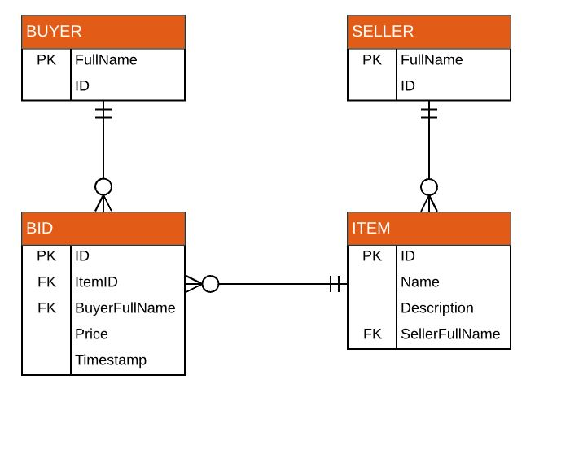

## Homework 8
The last coded homework that combines all of what we have learned so far this term.  This includes a multitable database created by me, javascript code running real time while the page is being viewed, Linq queries to pull data from the database for html views, and RAZOR code used with strongly typed views on view pages in the MVC app.  Database details included in ER diagram and links to specific information regarding this homework are listed below.
  
## Links
1. [Assignment Page](https://www.wou.edu/~morses/classes/cs46x/assignments/HW8_1819.html)
2. [Code Repository for HW8](https://github.com/avickers17/avickers17.github.io/tree/master/cs460/HW8)
3. [Working Demo](https://youtu.be/shFxF78_JrU)

## Want to go back?
* Back to my Homepage: [Homepage](https://avickers17.github.io)
* Back to my Homework Page: [Homework](https://avickers17.github.io/cs460/)

### E-R Diagram

### Video Demo
To see my Homework8 in action, I created a working demo video.  Please see the link above to view how my program works!

