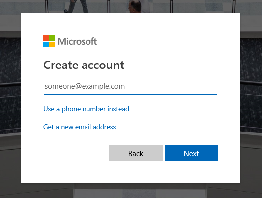
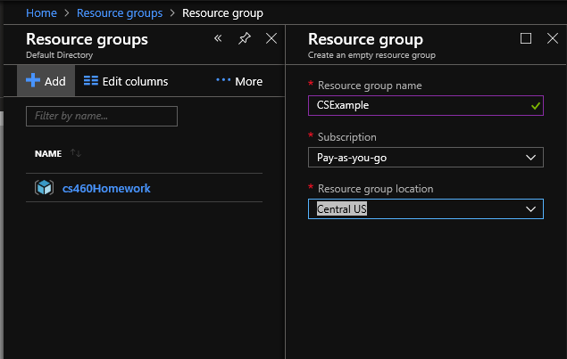
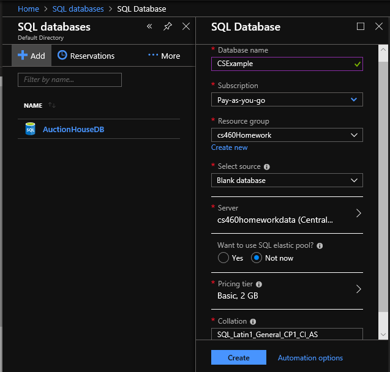
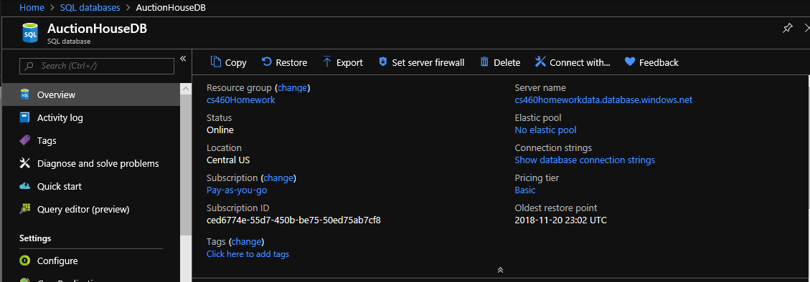

## Homework 9
For this assignment, we were to take our MVC Application from HW8 and deploy it to the cloud.  In order to do this, we were tasked with using Azure to assist us with deployment.  We have to first make an account, then create a resource group, add a database to that resource group, connect our local Microsoft SQL Server Management to that database, connect our MVC App to that DB connection, and finally deploy our project to the cloud.  Below I will walk through each of these steps in more detail as to understand everything that was needed to create this functionality.
  
## Links
1. [Assignment Page](https://www.wou.edu/~morses/classes/cs46x/assignments/HW9_1819.html)
2. [Code Repository for HW8](https://github.com/avickers17/avickers17.github.io/tree/master/cs460/HW8)
3. [Cloud Deployment Link]()

## Want to go back?
* Back to my Homepage: [Homepage](https://avickers17.github.io)
* Back to my Homework Page: [Homework](https://avickers17.github.io/cs460/)

### Azure (Account and Resource Group)
Create an account with Azure. 

Create Page:

Then create a resource group:
1. Click on Resource Groups
2. Select Add (top of page)
3. Give the Group a Name
4. Choose Subscription (Pay as you go)
5. Choose Location (Central US)
6. Click Create

Add a Resouce:

### Database (Server on Azure)
On Azure Select SQL Databases:
1. Select Add (top of page)
2. Give the DB a Name
3. Choose Subscription (Pay as you go)
4. Select the Resource Group you are going to use
5. Select Source (Blank Database)
6. Create a new server
7. Give the server a Name
8. Create an Admin user name
9. Create a Password
10. Choose Location (Central US)
11. Make sure the checkbox for "Allow Azure services to access server is checked"
12. Click the Select Button
13. Make sure the pricing tier is "Basic, 2GB" or $5.00 per month
14. Click Create

Add a Database:

### Connect Locally to Microsoft SQL Server Management Studio
Open up Microsoft SQL Server Management Studio
1. Click on Connect
2. Server Type should be Database Engine
3. Server Name should be obtained from Azure
4. In Azure Click on your Database
5. Next to Server Name click the copy button

Get the DB Server Name:

6. Paste this in the Management Studio Section for "Server Name"
7. Under Authentication, choose SQL Server Authentication
8. Enter Credentials for Azure SQL DB Server Information
9. Enter Login and Password Information
10. Click Connect
11. Firewall etc...

Management Studio Now Connected:

