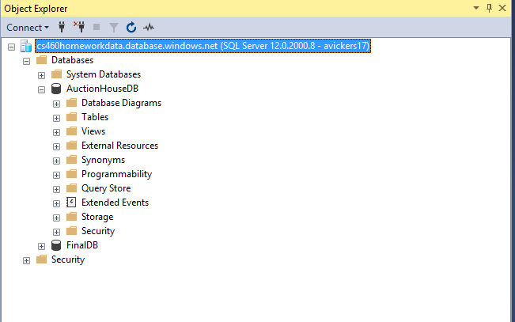

## Homework 9
For this assignment, we were to take our MVC Application from HW8 and deploy it to the cloud.  In order to do this, we were tasked with using Azure to assist us with deployment.  We have to first make an account, then create a resource group, add a database to that resource group, connect our local Microsoft SQL Server Management to that database, connect our MVC App to that DB connection, and finally deploy our project to the cloud.  Below I will walk through each of these steps in more detail as to understand everything that was needed to create this functionality.
  
## Links
1. [Assignment Page](https://www.wou.edu/~morses/classes/cs46x/assignments/HW9_1819.html)
2. [Code Repository for HW8](https://github.com/avickers17/avickers17.github.io/tree/master/cs460/HW8)
3. [Cloud Deployment Link](http://auctionhouseapp.azurewebsites.net/)

## Want to go back?
* Back to my Homepage: [Homepage](https://avickers17.github.io)
* Back to my Homework Page: [Homework](https://avickers17.github.io/cs460/)

### Azure (Account and Resource Group)
Create an account with Azure. 

Create Page:

Then create a resource group:
1. Click on Resource Groups
2. Select Add (top of page)
3. Give the Group a Name
4. Choose Subscription (Pay as you go)
5. Choose Location (Central US)
6. Click Create

Add a Resouce:

### Database (Server on Azure)
On Azure Select SQL Databases:
1. Select Add (top of page)
2. Give the DB a Name
3. Choose Subscription (Pay as you go)
4. Select the Resource Group you are going to use
5. Select Source (Blank Database)
6. Create a new server
7. Give the server a Name
8. Create an Admin user name
9. Create a Password
10. Choose Location (Central US)
11. Make sure the checkbox for "Allow Azure services to access server is checked"
12. Click the Select Button
13. Make sure the pricing tier is "Basic, 2GB" or $5.00 per month
14. Click Create

Add a Database:

### Firewall (Adding a Rule)
On Azure select the resource group in question
1. From there select your SQL server
2. Under Firewalls and Virtual Networks, select Show firewall settings
3. Add a rule by giving it a name and allowing your IP address access to the server (can also select a range)
4. Click Save (Important)

Add a Firewall Rule:

### Connect Locally to Microsoft SQL Server Management Studio
Open up Microsoft SQL Server Management Studio
1. Click on Connect
2. Server Type should be Database Engine
3. Server Name should be obtained from Azure
4. In Azure Click on your Database
5. Next to Server Name click the copy button

Get the DB Server Name:

6. Paste this in the Management Studio Section for "Server Name"
7. Under Authentication, choose SQL Server Authentication
8. Enter Credentials for Azure SQL DB Server Information
9. Enter Login and Password Information
10. Click Connect

Management Studio Now Connected:

### Connect to the online server in MVC
Open the Server Explorer tab
1. Under Azure, select SQL Databases
2. Select the DB and right click, select open in SQL Server Object Explorer
3. Right click SQL Server, click add SQL server
4. Under Azure, select the DB and enter password
5. Run up script and make connection to DB

DB Now Updated:

### Get the Connection String
The Connection String is online through Azure
1. On Azure select SQL Databases
2. Select Database and find option for Connection Strings
3. Replace old connection string and DB name with new connection information
4. In String update server user name and pw

### Create Web App on Azure
Back at Azure, Click on App Services
1. Click on Add
2. Select Web App, and hit Create
3. Name the App
4. Pay as you go/Use Existing Resource Group
5. App Service Plan: F1 WestPlanFree
6. Click Create
7. Back at App Services, select the App
8. Under Application Settings left, look for Connection Strings
9. Click Add New Connection String
10. "Name" should be DB name and "Value" should be connection string
11. "Type" is SQL server
12. Click "Save"

Web App Created:

### Deply to Azure
To publish we need to follow the below steps:
1. In MVC, under build click on Publish
2. New Profile, then Click App Service
3. Select Existing, then Select our App from the list below
4. If a refresh, click on publish

App on Azure Live:

